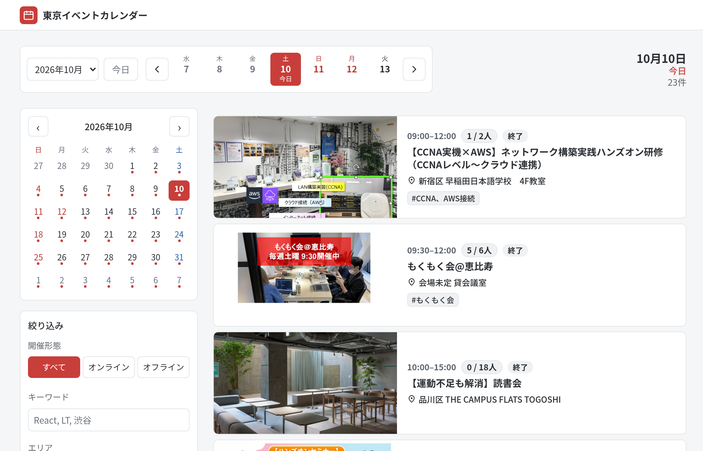
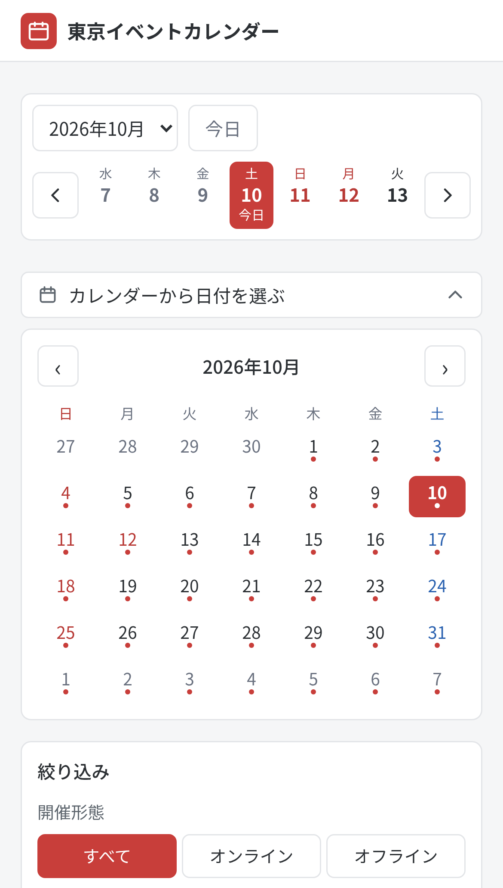

connpass でイベントを探している人へ

<h1 class="h1s">こんなこと、ありませんか？</h1>

「このイベント、今日予定空いてたから 行けたのに…」

「気になる connpass のイベント、 自分はつい見逃しちゃう」

「日付ごとに、パッと眺めて探したい」

東京イベントカレンダー（試作）

---

見やすい カレンダーを 作ってみました

平日の空いてる日も土日も、 行きたいと思えるイベントを 見つけたくて、東京近郊の connpass のイベントを 日付で一覧にしました。

connpass API のイベント情報を使った非公式の個人開発です

---

<h1 class="h1s">使うと、こう探せます</h1>
<ul class="res">
<li>来週の土曜に行けるイベントがすぐ分かる日付ナビ・カレンダー／土曜は青、日曜・祝日は赤</li>
<li>北区・港区など、行きやすいエリアの イベントだけ見られるエリアの複数選択</li>
<li>React や LT など、気になるテーマだけ オンライン／会場で探せるキーワード・開催形態の絞り込み</li>
<li>スマホでも日付から探せるカレンダーから日付を選択</li>
</ul>

東京・神奈川・埼玉・千葉の connpass のイベントを毎日自動更新

---

使ってみて、 感想ください！

名前も機能もまだまだ試作中です。 感想・改善案は @Sei_engineer までリプ・DMで！

サイトtokyo-event-calendar.illionillion.workers.dev

GitHub （要望・不具合は Issue でも歓迎）github.com/illionillion/tokyo-event-calendar

サイトを開く QR

※ connpass API のイベント情報を使った非公式の個人開発です

